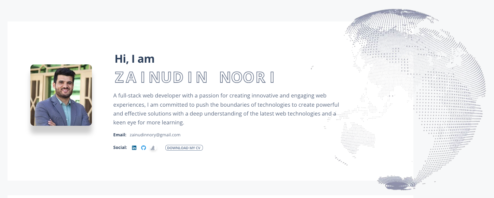

# Simple Portfolio Template - [Zainudin.me](https://zainudin.me)

## Introduction

This repository contains a simple and fast portfolio website template, designed using HTML, CSS, JavaScript, and SCSS. It's intended for developers and designers to use as a starting point for their own portfolio websites.

## Features

- Lightweight and responsive design.
- Ready-made sections for Introduction, Skills, Experience, Education, Projects, and Contact Form.
- Easily customizable and extendable.
- Minimal dependencies, making it fast and easy to deploy.

## Getting Started

To use this template for your own portfolio:

* Fork this repository.
* Customize the content in the HTML and SCSS files to reflect your own information.
* Host your website using a platform of your choice, such as GitHub Pages, Netlify, or your web server.

## Contributing

If you'd like to contribute to this template, please feel free to fork the repository and make improvements. Your contributions are greatly appreciated!

## Acknowledgements

This template was inspired by the need for a simple and fast portfolio website. It is influenced by various design and development principles from the open-source community.

## Author

- [Zainudin Noori](https://linkedin/in/zainudinnoori)

---

Enjoy using this portfolio website template for showcasing your skills and projects!
